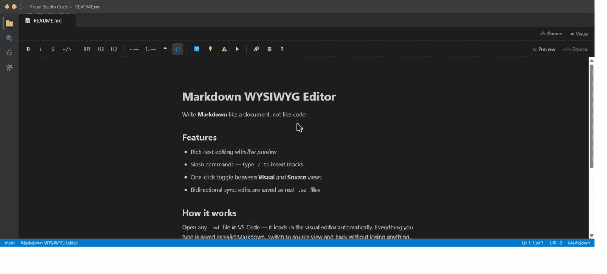

# Markdown WYSIWYG Editor

[](https://marketplace.visualstudio.com/items?itemName=JoelGarciaJr.markdown-visual-editor)
[](https://marketplace.visualstudio.com/items?itemName=JoelGarciaJr.markdown-visual-editor)
[](LICENSE)

**Write Markdown like a document, not like code.**

A VS Code extension that opens `.md` files in a **rich-text visual editor** — think Notion or Typora, but living right inside VS Code. No external apps, no browser tabs. Press `Alt+M` to toggle back to raw Markdown at any time.



---

## How it works

Open any `.md` file and it loads in the visual editor automatically. Everything you type is saved as valid Markdown. Switch to source view and back without losing anything.

- **Visual → file**: edits are serialized to Markdown and saved via the normal VS Code document API (`Ctrl+S` works as expected).
- **File → visual**: external changes (git pull, another editor) are reflected live.
- **No lock-in**: your files stay as plain `.md` — the extension is purely a view layer.

---

## Features

| What | Detail |
|---|---|
| **Rich-text editing** | Bold, italic, strikethrough, inline code, headings H1–H3, bullet lists, numbered lists, blockquotes, code blocks, links, images |
| **Slash commands** | Type `/` to open the block-type menu (heading, list, code block, quote…) |
| **Toolbar** | One-click formatting bar above the editor |
| **Toggle source** | Button in the editor title bar or `Alt+M` to switch to/from raw Markdown |
| **Side-by-side preview** | Rendered Markdown preview next to the visual editor |
| **Image drag & drop** | Drag images into the editor or paste from clipboard (embedded as data URL) |
| **Dark mode** | Follows VS Code's active color theme automatically |
| **Bidirectional sync** | Live sync in both directions with loop-prevention |

---

## Getting started

1. Install the extension from the VS Code Marketplace.
2. Open any `.md` or `.markdown` file — it opens in the visual editor by default.
3. Start writing. Press `Ctrl+S` to save as usual.

To switch back to the plain text editor, click the **`</> Source`** button in the editor title bar or press `Alt+M`.

---

## Switching the default editor

The extension sets itself as the **default editor** for `*.md` files. To change this:

- Right-click a `.md` file → **Open With…** → choose **Text Editor**
- Or add to your `settings.json`:

```jsonc
{
  "workbench.editorAssociations": {
    "*.md": "default"  // use the built-in text editor
    // "*.md": "markdownVisualEditor.editor"  // use the visual editor
  }
}
```

---

## Keyboard shortcuts

| Shortcut | Action |
|---|---|
| `Alt+M` | Toggle between visual and source editor |
| `Ctrl+S` | Save (works normally in both modes) |
| `/` | Open slash command menu (block types) |

---

## Known limitations

- Images dropped or pasted into the editor are embedded as **base64 data URLs** directly in the Markdown file. This keeps things portable but increases file size. Saving to disk with a relative path is planned.
- Tables and task lists are not yet supported in the visual editor (the underlying TipTap extensions are available and will be added).

---

## Built with

- [TipTap](https://tiptap.dev/) / [ProseMirror](https://prosemirror.net/) — rich-text editor engine
- [markdown-it](https://github.com/markdown-it/markdown-it) — Markdown parser
- [tiptap-markdown](https://github.com/ueberdosis/tiptap) — document ↔ Markdown serializer
- VS Code `CustomTextEditorProvider` API — native editor integration

---

## License

MIT — see [LICENSE](LICENSE).
